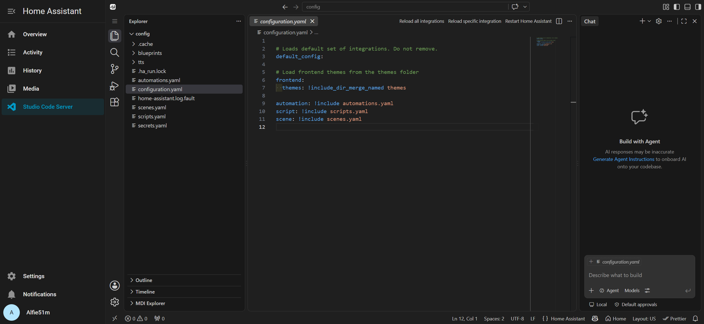

# Home Assistant Add-on: Studio Code Server

[![GitHub Release][releases-shield]][releases]
![Project Maintenance][maintenance-shield]

![Project Stage][project-stage-shield]
[![License][license-shield]](LICENSE.md)

![Supports amd64 Architecture][amd64-shield]
![Supports aarch64 Architecture][aarch64-shield]

A VSCode experience, accessible through the browser.

## About

This add-on runs [code-server](https://github.com/coder/code-server), which
gives you a Visual Studio Code experience straight from the browser. It allows
you to edit your Home Assistant configuration directly from your web browser,
directly from within the Home Assistant frontend.

This is a fork of the original
[Studio Code Server][upstream] add-on by Franck Nijhof, maintained here to
keep the bundled editor and extensions current. The upstream add-on had gone
without a version bump for an extended period.

This add-on publishes a prebuilt multi-arch image via GitHub Actions on
every release, so installs and updates pull the image from GHCR instead of
building on your host.

[Read the full add-on documentation][docs]

## Support

This is a personal fork maintained by [Alfie51m][me]. It is
not affiliated with or supported by the original Studio Code Server project
or its Discord/Community Forum channels.

If you run into an issue specifically with this fork, feel free to
[open an issue here][issue].

For the original, unsupported project, see
[hassio-addons/addon-vscode][upstream].

## Authors & contributors

The original setup of this repository is by [Franck Nijhof][frenck]. This
fork's version bumps and modifications are maintained by [Alfie51m][me].

## License

MIT License

Copyright (c) 2019-2025 Franck Nijhof

Permission is hereby granted, free of charge, to any person obtaining a copy
of this software and associated documentation files (the "Software"), to deal
in the Software without restriction, including without limitation the rights
to use, copy, modify, merge, publish, distribute, sublicense, and/or sell
copies of the Software, and to permit persons to whom the Software is
furnished to do so, subject to the following conditions:

The above copyright notice and this permission notice shall be included in all
copies or substantial portions of the Software.

THE SOFTWARE IS PROVIDED "AS IS", WITHOUT WARRANTY OF ANY KIND, EXPRESS OR
IMPLIED, INCLUDING BUT NOT LIMITED TO THE WARRANTIES OF MERCHANTABILITY,
FITNESS FOR A PARTICULAR PURPOSE AND NONINFRINGEMENT. IN NO EVENT SHALL THE
AUTHORS OR COPYRIGHT HOLDERS BE LIABLE FOR ANY CLAIM, DAMAGES OR OTHER
LIABILITY, WHETHER IN AN ACTION OF CONTRACT, TORT OR OTHERWISE, ARISING FROM,
OUT OF OR IN CONNECTION WITH THE SOFTWARE OR THE USE OR OTHER DEALINGS IN THE
SOFTWARE.

[aarch64-shield]: https://img.shields.io/badge/aarch64-yes-green.svg
[amd64-shield]: https://img.shields.io/badge/amd64-yes-green.svg
[docs]: https://github.com/Alfie51m/addon-vscode/blob/main/vscode/DOCS.md
[frenck]: https://github.com/frenck
[issue]: https://github.com/Alfie51m/addon-vscode/issues
[license-shield]: https://img.shields.io/github/license/Alfie51m/addon-vscode.svg
[me]: https://github.com/Alfie51m
[upstream]: https://github.com/hassio-addons/addon-vscode
[project-stage-shield]: https://img.shields.io/badge/project%20stage-production-brightgreen.svg
[releases]: https://github.com/Alfie51m/addon-vscode/releases
[releases-shield]: https://img.shields.io/github/release/Alfie51m/addon-vscode.svg
[maintenance-shield]: https://img.shields.io/maintenance/yes/2026.svg